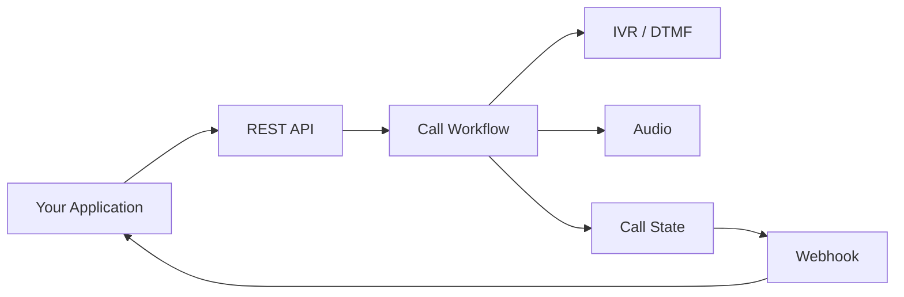

# PySpoof VoIP Bot API

> Developer-first reference for programmable voice, IVR, DTMF, call history, audio prompts, balances, and webhook workflows.

<p align="center">
  
  
  
  
</p>

PySpoof VoIP Bot API is a **public developer reference** for integrating programmable voice workflows into applications.

The repository demonstrates the API contract and developer experience using **placeholder infrastructure and mock responses**. It contains no production API keys, SIP credentials, carrier configuration, or private implementation.

## ✨ What you can build

- ☎️ Programmable outbound call workflows
- 🔢 IVR and DTMF menus
- 🎙️ Audio prompt workflows
- 📋 Call history and status tracking
- 💳 Usage / credit checks
- 🔔 Webhook-driven call events
- 🧩 Custom call-routing logic
- 🛠️ Local development and testing

## ⚡ Quick start

### 1. Configure your environment

```bash
export VOIP_API_URL="https://api.pyspoof.com"
export VOIP_API_KEY="your_api_key_here"
```

> The URL above is intentionally a placeholder. Replace it with the API endpoint supplied by your deployment/provider.

### 2. Ping the service

```bash
curl "$https://api.pyspoof.com/callpanel/api/ping"
```

Example response:

```json
{
  "status": "ok",
  "service": "voice-api"
}
```

### 3. Check your balance

```bash
curl \
  -H "X-API-Key: $VOIP_API_KEY" \
  "$VOIP_API_URL/callpanel/api/balance"
```

Example:

```json
{
  "balance": 1250,
  "unit": "credits"
}
```

### 4. View call history

```bash
curl \
  -H "X-API-Key: $VOIP_API_KEY" \
  "$VOIP_API_URL/callpanel/api/calls"
```

Example:

```json
{
  "calls": [
    {
      "id": "call_demo_123",
      "status": "completed",
      "duration": 18
    }
  ]
}
```

### 5. Read the DTMF keymap

```bash
curl \
  -H "X-API-Key: $VOIP_API_KEY" \
  "$VOIP_API_URL/callpanel/api/keymap"
```

Example:

```json
{
  "1": "connect-agent",
  "2": "repeat-menu",
  "3": "play-hours",
  "9": "end-call"
}
```

### 6. List audio prompts

```bash
curl \
  -H "X-API-Key: $VOIP_API_KEY" \
  "$VOIP_API_URL/callpanel/api/audio/list"
```

Example:

```json
{
  "audio": [
    {
      "id": "welcome_demo",
      "name": "Welcome",
      "format": "gsm"
    }
  ]
}
```

## 📚 API reference

| Endpoint | Method | Auth | Purpose |
|---|---|---|---|
| `/callpanel/api/ping` | GET | No | Service health |
| `/callpanel/api/balance` | GET | API key | Credit / usage balance |
| `/callpanel/api/calls` | GET | API key | Call history |
| `/callpanel/api/keymap` | GET | API key | DTMF actions |
| `/callpanel/api/audio/list` | GET | API key | Available audio prompts |

See [`docs/api-reference.md`](docs/api-reference.md) for request and response examples.

## 🔐 Authentication

API requests use an API key supplied through the `X-API-Key` header.

```http
X-API-Key: your_api_key_here
```

For local development:

```bash
export VOIP_API_KEY="your_api_key_here"
```

**Never hard-code credentials in source files.**

## 🐍 Python

```python
import os
import requests

base_url = os.environ["VOIP_API_URL"]
api_key = os.environ["VOIP_API_KEY"]

response = requests.get(
    f"{base_url}/callpanel/api/calls",
    headers={"X-API-Key": api_key},
    timeout=15,
)

response.raise_for_status()
print(response.json())
```

## 🟨 JavaScript

```js
const response = await fetch(
  `${process.env.VOIP_API_URL}/callpanel/api/calls`,
  {
    headers: {
      "X-API-Key": process.env.VOIP_API_KEY
    }
  }
);

console.log(await response.json());
```

## 🧪 Try it without a real account

The repository includes a local mock API:

```bash
npm install
npm run mock-api
```

Then:

```bash
curl http://127.0.0.1:8787/callpanel/api/ping
```

The mock server never places calls and never contacts a carrier.

## 📦 Postman

Import:

```text
postman/pyspoof-voip-bot-api.postman_collection.json
```

Then configure:

```text
baseUrl = https://api.example.com
apiKey  = your_api_key_here
```

## 🧾 OpenAPI

The public contract is available at:

[`openapi/openapi.yaml`](openapi/openapi.yaml)

It uses `https://api.example.com` as the example server so production infrastructure is not embedded in the repository.

## 🔔 Webhooks

A typical event can look like:

```json
{
  "id": "evt_demo_001",
  "type": "call.dtmf",
  "timestamp": "2026-08-08T12:00:00Z",
  "data": {
    "callId": "call_demo_123",
    "digit": "1"
  }
}
```

See [`docs/webhooks.md`](docs/webhooks.md).

## 🗺️ Architecture



The public repository documents the **interface**, not the private telephony infrastructure.

## 🛡️ What is intentionally NOT included

This repository does not contain:

- production API keys
- SIP usernames/passwords
- carrier credentials
- private server addresses
- production database configuration
- internal routing logic
- customer records
- billing implementation
- production call-control code

That separation is intentional.

## 🔎 Topics

`voip` `telephony` `voice-api` `voice-bot` `ivr` `dtmf` `sip` `call-automation` `call-routing` `programmable-voice` `telephony-api` `webhooks` `nodejs` `python` `rest-api` `openapi`

## 📄 License

MIT.
