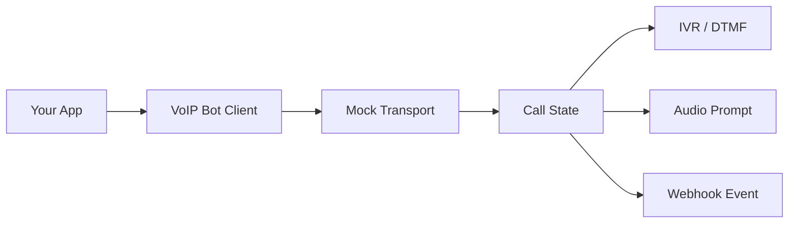

# PySpoof VoIP Bot API

> A lightweight, provider-neutral interface for building programmable voice workflows, call automation, IVR menus, and telephony integrations.

<p align="center">
  
  
  
  
</p>

**PySpoof VoIP Bot API** is a public reference implementation for developers experimenting with **voice bots, IVR, DTMF routing, call state machines, audio prompts, webhooks, and programmable telephony**.

The repository intentionally contains **no production credentials, private infrastructure details, carrier configuration, or live API implementation**.

## ✨ What is inside?

- ☎️ Call lifecycle abstractions
- 🔢 DTMF / keymap handling
- 🎙️ Audio prompt references
- 🧩 IVR state-machine examples
- 🔔 Webhook event models
- 💳 Mock balance / usage responses
- 🧪 Local mock transport
- 🛡️ Safe environment-variable configuration
- 📦 Small dependency footprint
- 📝 API-oriented documentation

## 🗺️ Architecture



The public repository models the **developer-facing contract**, rather than exposing the infrastructure behind a hosted telephony service.

## 🚀 Quick start

```bash
git clone https://github.com/pyspoof/voip-bot-api.git
cd voip-bot-api

node examples/basic-call.js
```

No API key is required for the included examples.

## 📁 Project layout

```text
.
├── examples/
│   ├── basic-call.js
│   ├── dtmf-menu.js
│   └── webhook-event.js
├── src/
│   ├── client.js
│   ├── mock-transport.js
│   └── schemas.js
├── docs/
│   ├── architecture.md
│   └── keymap.md
├── .github/
│   ├── ISSUE_TEMPLATE/
│   │   ├── bug_report.md
│   │   └── feature_request.md
│   └── workflows/
│       └── ci.yml
├── .env.example
├── CONTRIBUTING.md
├── LICENSE
├── package.json
├── SECURITY.md
└── README.md
```

## 🔌 Example

```js
import { VoipBotClient } from "../src/client.js";

const client = new VoipBotClient({
  transport: "mock"
});

const call = await client.calls.create({
  destination: "+15550000000",
  workflow: "demo-ivr"
});

console.log(call.id);
console.log(call.status);
```

The example uses a **mock transport**. It does not place a real call.

## 🔢 DTMF routing

A keymap can turn keypad input into application events:

```js
const keymap = {
  "1": "connect-agent",
  "2": "repeat-menu",
  "3": "play-hours",
  "9": "end-call"
};
```

See [`docs/keymap.md`](docs/keymap.md) for the state-machine approach.

## 🧪 Local development

```bash
npm install
npm test
```

The test suite runs entirely against the mock transport.

## 🔐 Security

Never commit:

- API keys
- SIP passwords
- webhook signing secrets
- carrier credentials
- private hostnames
- production phone-number inventories

Use environment variables for local development and enable GitHub secret scanning / push protection for public repositories. GitHub specifically recommends secret scanning, push protection, Dependabot, and code scanning for repository security. 

See [`SECURITY.md`](SECURITY.md).

## 🎯 Topics

Suggested GitHub topics:

`voip` `telephony` `voice-bot` `ivr` `dtmf` `sip` `call-automation` `voice-api` `telephony-api` `rest-api` `nodejs` `webhooks` `call-routing` `programmable-voice` `voice-agents`

GitHub recommends using relevant repository topics because they help people discover projects by subject and purpose. citeturn0search3

## 📌 Why a reference implementation?

The goal is to make the public repository useful without publishing private infrastructure.

This project therefore separates:

**Public contract**
→ request models → response models → examples → mock behavior

from:

**Private implementation**
→ carrier credentials → SIP trunks → production routing → billing logic → internal services

That separation keeps the repository reproducible and safe to inspect.

## 📚 Documentation

- [Architecture](docs/architecture.md)
- [DTMF keymaps](docs/keymap.md)
- [Contributing](CONTRIBUTING.md)
- [Security](SECURITY.md)

## 📄 License

MIT — see [`LICENSE`](LICENSE).
